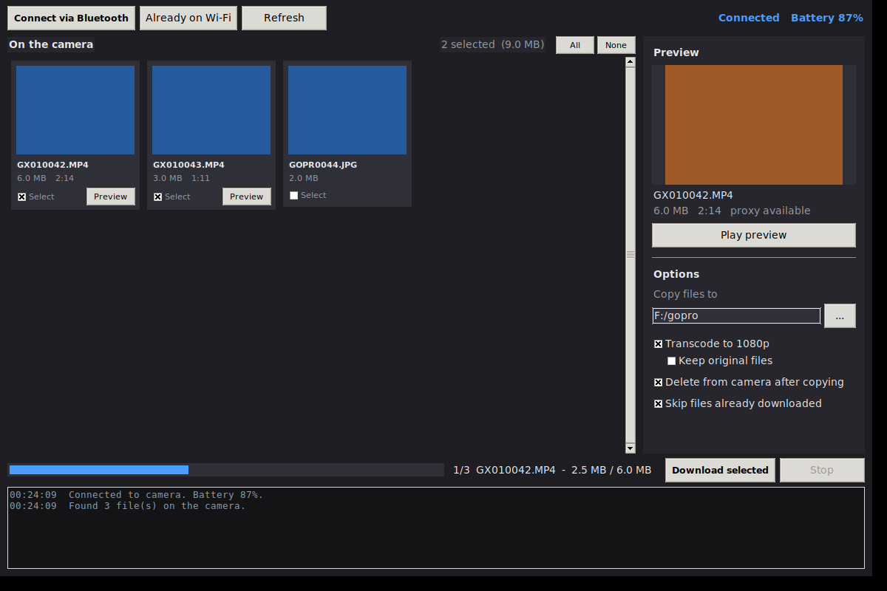

# GoPro Unloader

A **Windows desktop app**, a **command-line script**, and an **Android app** that
automate the full offload workflow for a **GoPro Hero 11 Mini**:

1. **Wakes** the camera via Bluetooth LE
2. **Downloads** all videos over WiFi using the [GoPro Open API](https://gopro.github.io/OpenGoPro/)
3. **Deletes** the downloaded files from the camera
4. **Transcodes** them to 1080p H.264/AAC using FFmpeg

| I want to... | Run |
|---|---|
| Browse thumbnails, preview clips, pick what to copy | `python gopro_gui.py` |
| Offload everything unattended | `python gopro_unloader.py` |
| Do it from a phone | the `app/` Android project |

Both Python front ends share `gopro_core.py`, which holds all the BLE, HTTP,
and FFmpeg logic.

---

## Requirements

| Dependency | Purpose |
|---|---|
| Python 3.11+ | Runtime |
| [`bleak`](https://github.com/hbldh/bleak) | Bluetooth LE communication |
| [`requests`](https://docs.python-requests.org/) | HTTP downloads & GoPro API |
| [`tqdm`](https://github.com/tqdm/tqdm) | Download & transcode progress bars (CLI) |
| [`Pillow`](https://python-pillow.org/) | Thumbnail rendering (GUI) |
| [`ffmpeg`](https://ffmpeg.org/) | Video transcoding (must be on `PATH`) |
| `ffplay` | Video preview in the GUI (ships with FFmpeg) |

`tkinter` powers the GUI and ships with the standard python.org Windows
installer. If you get `ModuleNotFoundError: No module named 'tkinter'`,
re-run the installer and tick **tcl/tk and IDLE**.

### Install Python dependencies

```bash
pip install -r requirements.txt
```

### Install FFmpeg

```bash
# macOS
brew install ffmpeg

# Ubuntu / Debian
sudo apt install ffmpeg

# Windows – download from https://ffmpeg.org/download.html
```

---

## Setup

1. **Enable Bluetooth** on your computer.
2. **Enable WiFi** on your computer and connect to the GoPro's WiFi network
   (`SSID` and password are shown in the camera's *Connections → Connect Device* menu).
3. The script will handle waking the camera via BLE automatically.

> **Tip:** If your camera is already on and the WiFi is connected, use `--skip-ble`
> to bypass the Bluetooth step.

---

## Windows app

```bash
python gopro_gui.py
```



### What you can do

**Connect**
- **Connect via Bluetooth** wakes the camera (even from sleep), reads the WiFi
  SSID and password off it, and turns its hotspot on. The credentials appear in
  a banner with a **Copy password** button, and on Windows a **Join
  automatically** button asks the adapter to switch networks for you. If that
  fails, join from the Windows WiFi menu — the app keeps waiting either way.
- **Already on WiFi** skips Bluetooth entirely when the camera is up.
- Battery level shows in the corner once connected, and a keepalive ping runs
  the whole time you're connected so the camera never sleeps mid-transfer.

**Browse**
- Every clip and photo on the card appears as a thumbnail tile pulled straight
  from the camera, with filename, size and duration. The `.LRV`/`.THM` proxy
  files the camera keeps alongside each clip are hidden.
- Videos start pre-selected, photos don't. **All** / **None** select in bulk,
  and the header keeps a running count and total size of what you've picked.

**Preview before downloading**
- Click a tile for a full-size preview frame in the sidebar; **Play preview**
  (or double-clicking the tile) streams the clip in an `ffplay` window
  *without downloading it*.
- It streams the camera's low-res `.LRV` proxy when one exists, so preview
  starts in a second or two even for a multi-gigabyte clip. Clips with no
  proxy stream at full resolution and may buffer.

**Options** (all in the sidebar, applied when you hit Download)
- **Copy files to** — pick any destination folder.
- **Transcode to 1080p** — on by default; **Keep original files** decides
  whether the raw download survives the transcode.
- **Delete from camera after copying** — asks for confirmation first, and only
  ever deletes files that downloaded successfully. Deleting a clip also removes
  its `.LRV`/`.THM` siblings, so the card actually frees up.
- **Skip files already downloaded** — makes re-runs resume instead of refetch.

**During a transfer** a progress bar tracks the whole run file by file, **Stop**
cancels cleanly (partial files are removed), and the log pane at the bottom
carries the same messages the CLI prints.

---

## Command line

```
python gopro_unloader.py [OPTIONS]
```

### Options

| Flag | Default | Description |
|---|---|---|
| `--output-dir`, `-o` | `F:/gopro` | Directory for downloaded and transcoded files |
| `--keep-originals` | off | Keep raw downloaded files alongside transcoded versions (skips the interactive prompt) |
| `--no-delete` | off | Download videos but do **not** delete them from the camera |
| `--no-transcode` | off | Skip the FFmpeg transcoding step entirely |
| `--all`, `-a` | off | Re-download every file, even ones that already exist locally |
| `--list`, `-l` | off | List the files on the camera and exit without downloading |
| `--skip-ble`, `--no-ble` | off | Skip Bluetooth wake (camera is already awake) |
| `--ble-address` | *(auto)* | Manually specify the GoPro BLE address |

If `--keep-originals` is not passed, the script asks once before transcoding whether
to keep the raw downloads.

### Examples

```bash
# Basic usage – download, delete from camera, transcode
python gopro_unloader.py

# Save to a custom directory and keep the raw files
python gopro_unloader.py --output-dir ~/Videos/GoPro --keep-originals

# Camera is already on; skip BLE scan
python gopro_unloader.py --skip-ble

# Download only, don't delete from camera
python gopro_unloader.py --no-delete

# See what's on the camera without downloading anything
python gopro_unloader.py --list
```

---

## Output Structure

```
F:/gopro/         # or whatever --output-dir points at
├── raw/          # Original files downloaded from camera (deleted after transcode
│                 # unless --keep-originals is set or you answer "y" at the prompt)
└── transcoded/   # 1080p H.264/AAC MP4 files
```

---

## How It Works

### 1. Bluetooth Wake
Uses `bleak` to scan for a device whose name starts with `"GoPro"`, connects, and writes a BLE command to the GoPro Command characteristic (`b5f90072-…`). This wakes the camera and brings up the WiFi Access Point.

### 2. WiFi Download
Polls `http://10.5.5.9:8080/gopro/media/list` until the camera's HTTP server responds, then iterates over the media and streams each file down in 64 KiB chunks. A background thread pings `/gopro/camera/keep_alive` every 2.5 s so the camera doesn't sleep part-way through.

### 3. Thumbnails and Preview (GUI)
Tiles try three sources in order and use the first that returns a real JPEG:

1. `/gopro/media/thumbnail?path=…` — the documented endpoint
2. `/gopro/media/screennail?path=…` — larger frame, also used for the sidebar
3. the `.THM` sidecar the camera writes next to every clip, fetched over the
   same `/videos/DCIM/…` path as the downloads

The `.THM` fallback matters because the endpoints aren't reliable on every
firmware, while the sidecar is just a JPEG on the card. Requests go out **one
at a time** — the camera's HTTP server drops parallel requests, which shows up
as tiles that never load. Responses are checked for a real JPEG header, since
the camera sometimes answers `200` with a JSON error body.

Preview hands `ffplay` the URL of the clip's `.LRV` proxy so playback streams
off the camera with nothing written to disk.

### 4. Delete from Camera
Sends `DELETE http://10.5.5.9:8080/gopro/media/delete/file?path=<folder>/<name>` for each successfully downloaded file, plus the matching `.LRV` and `.THM` the camera stores beside it.

### 5. FFmpeg Transcode
Calls FFmpeg with:
- Video: `libx264`, `fast` preset, CRF 23
- Scaling: letterbox/pillarbox to exactly `1920×1080`
- Audio: `aac` at 192 kbps
- Container flag: `+faststart` for streaming-friendly output

---

## Diagnostics

```bash
python gopro_diag.py          # connect to the camera's WiFi first
```

Probes every thumbnail source against the first few files on the card and
prints exactly what the camera returned — status code, content type, and
whether the body was really a JPEG — then checks whether the camera tolerates
parallel requests. Use it if the grid comes up without thumbnails.

---

## Android App

The `app/` directory contains a native Android application that provides the same
offload workflow as the Python script, optimised for phones and tablets.

### Requirements

| Requirement | Details |
|---|---|
| Android 8.0+ (API 26) | Minimum supported OS |
| Bluetooth LE | Camera wake & WiFi credential reading |
| WiFi | File downloads from the GoPro hotspot |
| Storage | Files saved to `Android/data/com.gopro.unloader/files/Movies/GoProUnloader/` |

### Build

1. Open the `GoProUnloader` folder in **Android Studio Hedgehog** (or newer).
2. Let Gradle sync finish.
3. Connect a device (API 26+) or start an emulator with BLE support.
4. Run **▶ Run 'app'**.

### Usage

1. Tap **Start Offload** — the app will:
   - Scan for a nearby GoPro via Bluetooth LE and wake its WiFi AP.
   - Display the WiFi SSID and password on-screen.
   - Wait while you connect your phone to the GoPro's WiFi hotspot.
   - Download all new MP4 files with a per-file progress bar.
   - Delete downloaded files from the camera (unless **Don't delete** is checked).
   - Transcode each video to 1080p H.264/AAC using FFmpeg Kit.
2. Tap **List Files** to browse camera contents without downloading.
3. Tap the **⋮ Options** menu to toggle:
   - *Skip BLE* — if WiFi is already connected
   - *Keep originals* — retain raw downloads alongside 1080p copies
   - *Don't delete* — leave files on the camera
   - *Skip transcoding* — save raw downloads only
   - *Set BLE Address* — skip scanning if the camera's BLE address is known

### Output Structure

```
Android/data/com.gopro.unloader/files/Movies/GoProUnloader/
├── raw/          # Downloaded originals (removed after transcode unless --keep-originals)
└── transcoded/   # 1080p H.264/AAC MP4 files
```

---

## Troubleshooting

| Problem | Solution |
|---|---|
| Camera not found via BLE | Ensure Bluetooth is on and camera is within ~10 m. The camera only advertises for 8 hours after sleeping — press the power button once if it's been longer |
| WiFi not reachable | Connect your computer/phone to the GoPro WiFi AP first |
| `ffmpeg not found` | Install FFmpeg and ensure it is on your `PATH` (Python) |
| GUI: `No module named 'tkinter'` | Re-run the python.org installer and tick **tcl/tk and IDLE** |
| GUI: tiles say "no preview" | Run `python gopro_diag.py` — it reports which thumbnail source your camera actually serves. The log pane also names the failure per file. Downloads work regardless |
| GUI: **Play preview** does nothing | `ffplay` isn't on `PATH` — it's part of the full FFmpeg build, not the "essentials" one |
| GUI: **Join automatically** fails | Windows-only, and some adapters refuse it; connect from the WiFi menu instead |
| Download fails mid-way | Re-run the script/app; already-deleted files are gone but untouched files can be retried |
| Android: BLE permission denied | Grant *Nearby devices* permission in Android settings |
| Android: transcoding fails | Ensure the phone has sufficient free storage |

---

## License

MIT
